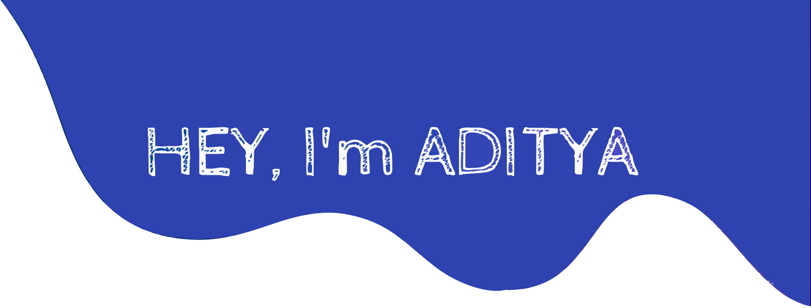

Hey there! I'm **Aditya Singh** 👋  
I love coding in **JavaScript** and **Python** 🐍. Freelancing keeps me busy, and I occasionally dive into hackathons for that extra thrill.

### Fun Stuff About Me
- Currently exploring **computer vision**  
- Always up for **React.js collabs**  
- Learning **Rust** (because why not?)  
- Ask me anything about **Python** & **JavaScript**  
- Fun fact: your face!! 😎  
- Experienced in both **frontend & backend projects**  
- Passionate about building **scalable & user-friendly applications**

### ☕ Let's Connect

  
  
  
  
  
  

<picture>
  <source media="(prefers-color-scheme: dark)" srcset="https://raw.githubusercontent.com/konhito/konhito/output/github-snake-dark.svg" />
  <source media="(prefers-color-scheme: light)" srcset="https://raw.githubusercontent.com/konhito/konhito/output/github-snake.svg" />
  
</picture>

<!-- Made with ❤️ using GPRM -->
